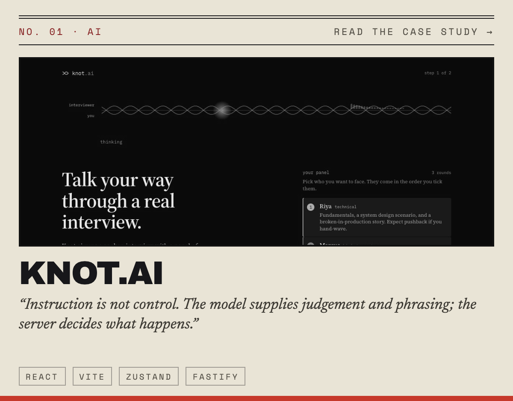
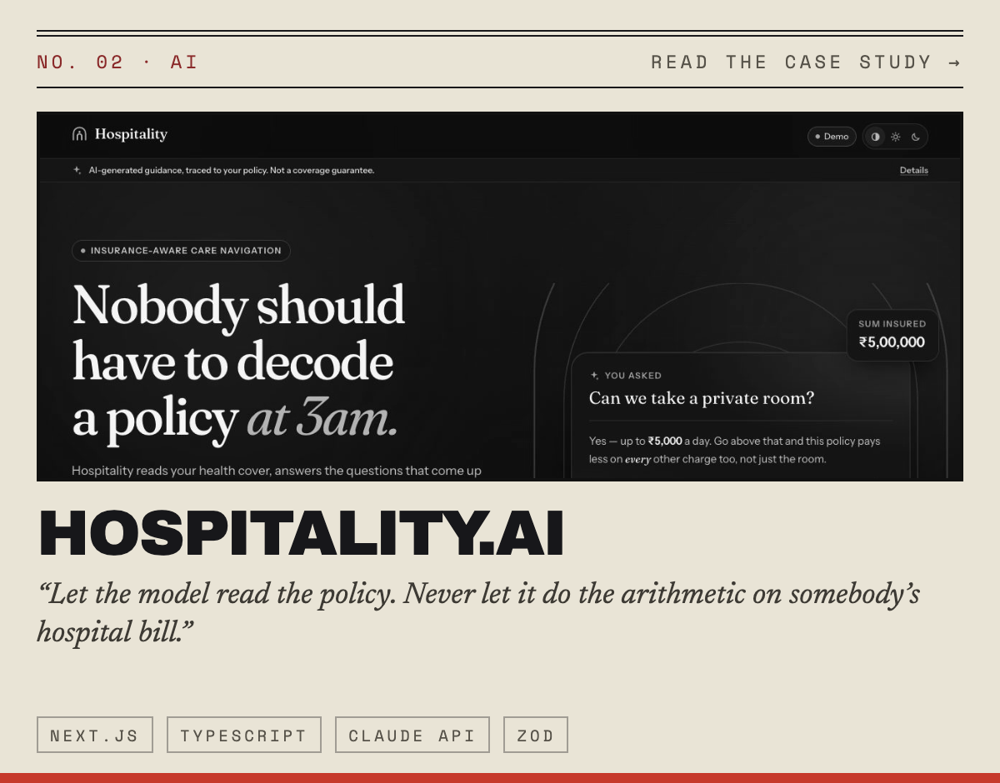
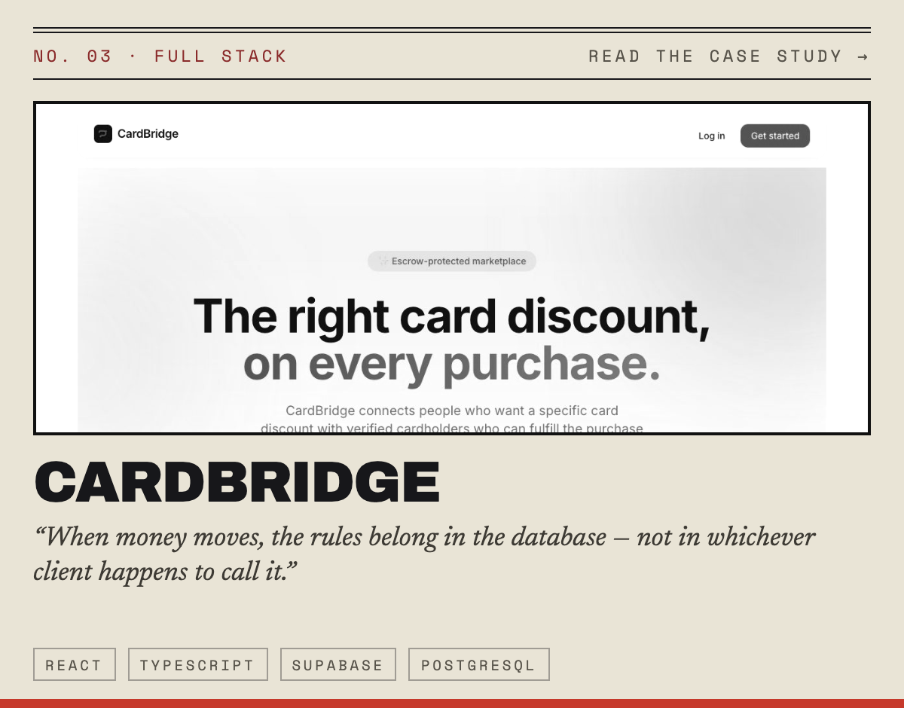
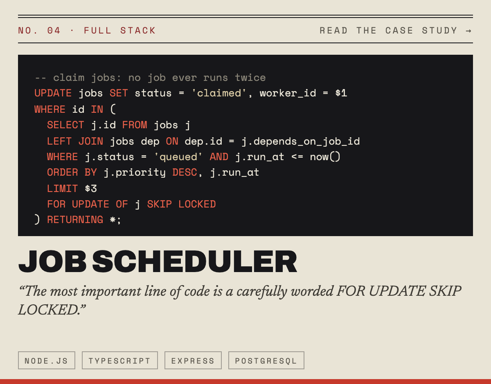
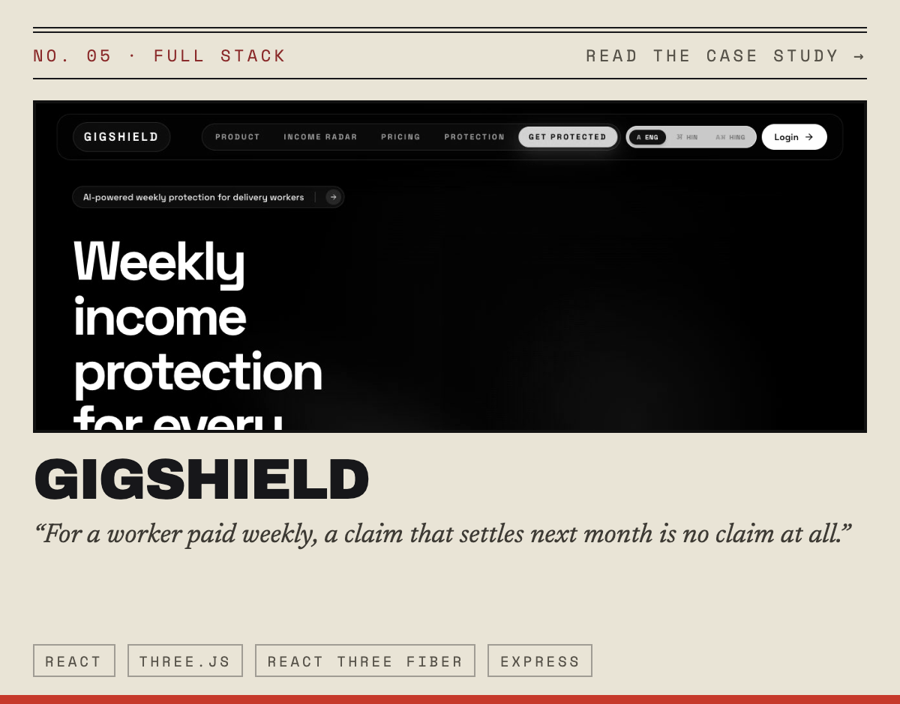
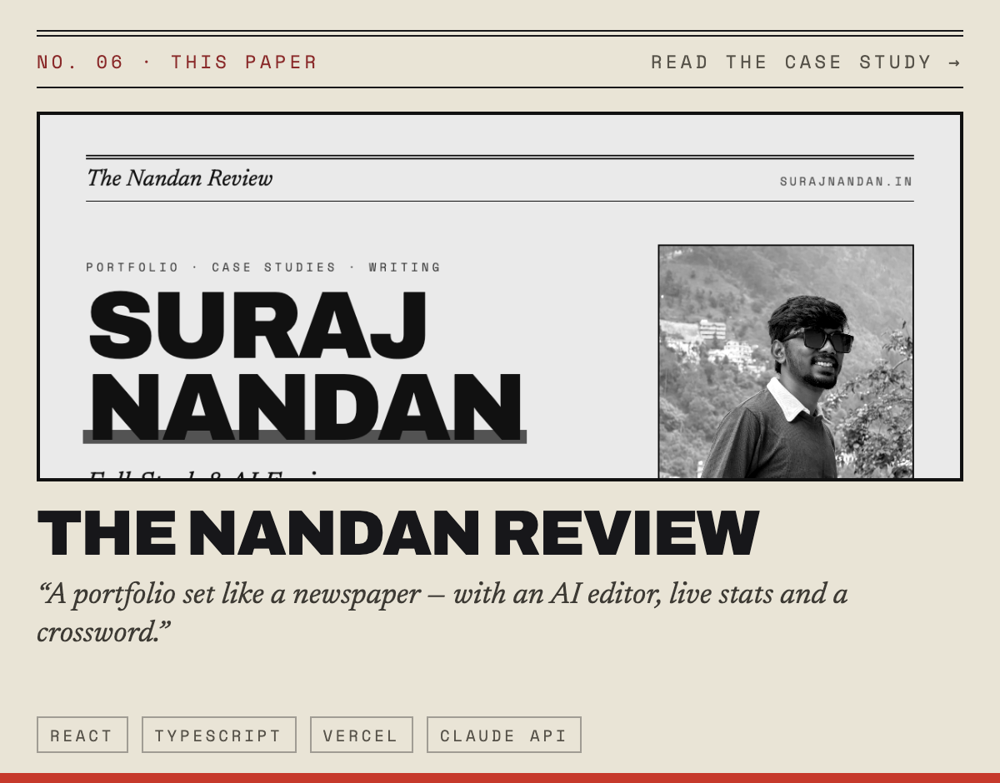

 

### Reliable web products and grounded AI systems, built end to end.

I'm **Suraj Nandan**, a full-stack and AI engineer from Kishanganj, India, studying Computer Science at SRM IST, Delhi NCR. I like to own a problem from end to end — the data model, the API, the interface — and I care most about software people can trust: it behaves the same way every time, explains itself, and fails honestly when it has to.

> 🏆 **Campus Winner, ACG Pack A Pitch 2.0** (Technology & Engineering) · 🥇 **NPTEL Gold Medal**, Human Computer Interaction

## 📰 The Front Page

  
  
  
  
  
  

Every card opens a full case study — the brief, the architecture, the decisions, and what broke along the way.

## 📊 By the Numbers

<a href="https://surajnandan.in/#github">
  <picture>
    <source media="(prefers-color-scheme: dark)" srcset="https://raw.githubusercontent.com/SpaceWalkerr/SpaceWalkerr/main/assets/scoreboard-dark.svg" />
    
  </picture>
</a>

Redrawn every morning from the live stats on surajnandan.in.

<picture>
  <source media="(prefers-color-scheme: dark)" srcset="https://raw.githubusercontent.com/SpaceWalkerr/SpaceWalkerr/output/snake-dark.svg" />
  
</picture>

## 🛠️ How I Work

- **Keep the model's job small.** Let the LLM judge and phrase; put the guarantees in code.
- **Make the database the referee.** Transactions, state machines and row-level security over good intentions.
- **Measure, then ship.** Code-split, cached, tested — and written up afterwards, mistakes included.

## 🧰 Toolbox

  
  
  
  
  
  
  
  
  
  
  
  

 

Set in the style of <a href="https://surajnandan.in">The Nandan Review</a> — my portfolio, printed like a newspaper. Try ↑ ↑ ↓ ↓ ← → ← → B A on the front page.

